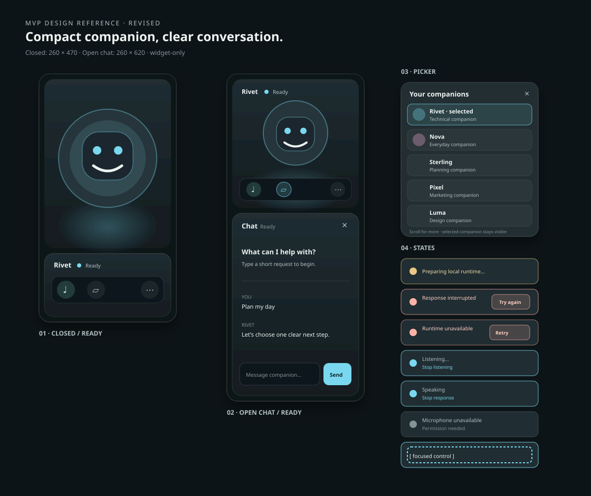

# MVP design reference

Status: revised draft reference for review.

This document and the companion SVG define the visual baseline for the MVP. They are intentionally smaller and calmer than the current prototype. Implementation should match this reference before adding polish or secondary surfaces.

## Visual direction

Quiet local instrument: dark graphite surfaces, one companion accent, soft edges, restrained glow, and strong readable states. The avatar is the emotional anchor; the controls should feel like a small dependable device around it.

## Tokens

| Token | Value | Use |
| --- | --- | --- |
| Background | `#0d1417` | Widget foundation |
| Surface | `#172125` | Main control card |
| Surface raised | `#202d32` | Picker, dialog, active card |
| Inset | `#10181c` | Inputs and transcript area |
| Text | `#edf4f1` | Primary labels and messages |
| Text soft | `#b3c0c4` | Supporting copy |
| Text muted | `#839398` | Metadata and inactive states |
| Hairline | `#ffffff1c` | Borders and separators |
| Accent / Rivet | `#79d8ef` | Default companion accent |
| Accent / Nova | `#f0a8d0` | Companion-specific accent |
| Warning | `#e7c885` | Preparing and retry states |
| Danger | `#ffb2a5` | Failure and interruption |

## Typography

- System sans-serif stack.
- Widget identity: 12px, semibold.
- Status and metadata: 10px.
- Body message: 12px with 1.5 line height.
- Section title: 13px, semibold.
- No all-caps except tiny eyebrow labels; use letter spacing sparingly.

## Geometry

- Closed widget: 260px wide × 470px high.
- Open-chat widget: 260px wide × 620px high.
- Card radius: 18px.
- Control radius: 10–12px.
- Outer padding: 10–12px.
- Toolbar controls: 38px square with 5px spacing.
- Chat expands vertically from the same right edge; it does not become a separate app window.
- No specialist rail, coding panel, calendar, HUD, or full-screen surface in the MVP.

## Interaction states

- Ready: neutral surface, companion accent used sparingly.
- Active: accent fill or outline with high contrast icon.
- Loading: warning accent and authored progress text.
- Listening: companion accent halo, clear `Listening…` label, and an explicit stop action.
- Speaking: restrained avatar/equalizer motion, readable transcript, and an explicit `Stop` action.
- Error: danger accent, concise explanation, one recovery action.
- Disabled: preserve readable contrast; explain why when the action is unavailable.
- Focus: 2px accent outline with 2px offset; never rely on color alone.

## Reference views

The SVG below shows the two most important implementation targets:

1. compact ready widget;
2. same widget with chat open;
3. companion picker overlay;
4. loading, listening, speaking, unavailable, and interrupted states;
5. visible keyboard focus treatment.

The mockup uses an abstract avatar silhouette so the geometry and hierarchy remain independent of any single companion artwork. Production implementation must use the approved companion portrait assets.

The picker is allowed to scroll when needed, but its close control and selected companion must remain visible. Microphone controls use readable contrast and authored labels such as `Allow microphone`, `Listening…`, `Stop listening`, `Speaking`, and `Microphone unavailable`. Voice failure never hides typed chat input.

## Review gate

This reference becomes approved only after the product owner confirms:

- the compact widget proportions;
- the avatar-to-control hierarchy;
- the chat-open composition;
- the picker and recovery states;
- the accent and state treatment;
- the decision to keep all specialist surfaces out of the MVP.
- the decision to keep all specialist surfaces out of the MVP.
